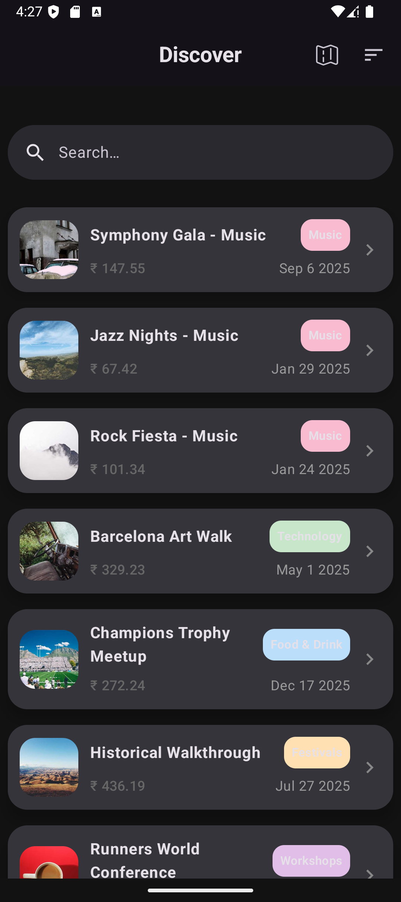
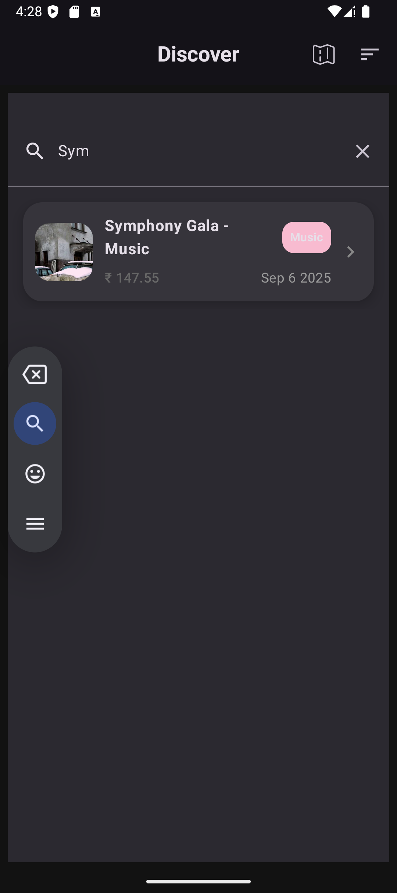
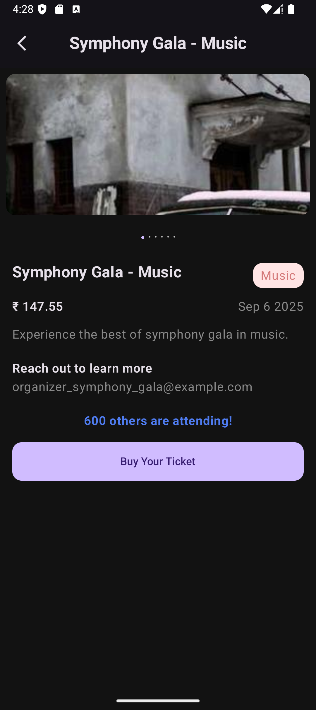
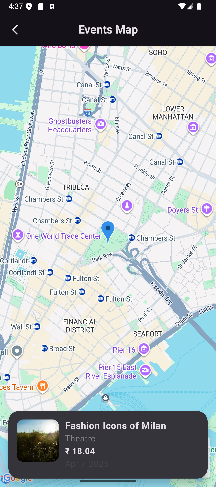

# <div align="center">  </div>
# Event Management System (KMP App)

A modern **Event Management** mobile application built using **Kotlin Multiplatform**, Jetpack Compose, and Google Maps.  
This app allows users to discover events, view details, and explore event locations on an interactive map.

---

## 🚀 Features

### 🏠 1️⃣ Discover Screen
- Displays a list of events with basic details  
- Search through events  
- Swipe-to-refresh support  
- Pagination for infinite scrolling  
- Sort events by category  
- Navigation to Event Details & Event Map screen  
- Tap on any event → opens Event Details screen

---

### 📄 2️⃣ Event Details Screen
- Shows complete event information  
- Event image carousel  
- Displays pricing & category details  

---

### 🗺️ 3️⃣ Event Map Screen
- Shows event locations on Google Maps  
- Horizontal swipe to change events  
- Only one event marker shown at a time  
- Smooth camera animation on swipe  

---

## 🛠️ Tech Stack & Dependencies

### 🔹 Android / Compose
``navigation-compose``  
``material-icons-core``  
``material-icons-extended``  
``maps-compose``  
``play-services-maps``  
``coil-compose``  
``coil-network-okhttp``  
``accompanist-pager``  
``accompanist-pager-indicators``  
``accompanist-swiperefresh``  

### 🔹 Networking (Ktor)
``ktor-client-core``  
``ktor-client-android``  
``ktor-client-okhttp``  
``ktor-client-content-negotiation``  
``ktor-serialization-kotlinx-json``  
``ktor-client-logging``  

### 🔹 Dependency Injection (Koin)
``koin-compose``  
``koin-compose-viewmodel``  
``koin-compose-viewmodel-navigation``  

### 🔹 Kotlin Multiplatform (KMP)
Used for shared business logic across modules

---

## 📸 Screenshots

| Launcher Screen | Discover Screen | Search Screen | Event Details | Event Map |
|----------------|----------------|---------------|
|  |  |  |  |  |

## 🎥 Demo Video

📌 *Short preview of the app in action*  
Add your demo video here 👇

🔗 e.g. YouTube / Drive Link  

## ⚙️ Setup & Installation

```sh
# Clone repository
git clone https://github.com/Bhushan2000/Event-Management-System.git

# Open in Android Studio (KMP-supported version)

# Sync Gradle & install dependencies

# Run the app on a device/emulator
